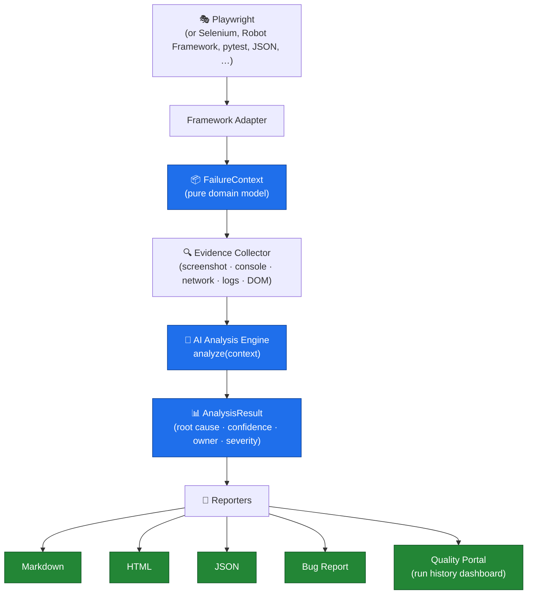

<div align="center">

# AIQA — AI-powered Quality Engineering SDK

**AI-powered Quality Engineering SDK for intelligent failure analysis, root cause detection, automated bug reporting, and developer-friendly quality insight.**

<br />

<!-- Group 1 — Project -->
[](https://pypi.org/project/multi-framework-tc-failure-ai-analyzer/)
[](https://pypi.org/project/multi-framework-tc-failure-ai-analyzer/)
[](LICENSE)
[](#)
[](#)

<!-- Group 2 — Quality -->
[](https://github.com/amandeepsdet/multi-framework-tc-failure-ai-analyzer/actions/workflows/ci.yml)
[](https://github.com/amandeepsdet/multi-framework-tc-failure-ai-analyzer/actions/workflows/ci.yml)
<!-- TODO(coverage): enable once coverage reporting (e.g. Codecov) is wired —
[](https://codecov.io/gh/amandeepsdet/multi-framework-tc-failure-ai-analyzer) -->
[](https://github.com/astral-sh/ruff)
[](https://github.com/psf/black)
[](#)

<!-- Group 3 — Community -->
[](https://github.com/amandeepsdet/multi-framework-tc-failure-ai-analyzer/stargazers)
[](https://github.com/amandeepsdet/multi-framework-tc-failure-ai-analyzer/network/members)
[](https://github.com/amandeepsdet/multi-framework-tc-failure-ai-analyzer/issues)
[](https://github.com/amandeepsdet/multi-framework-tc-failure-ai-analyzer/pulls)
[](https://pypi.org/project/multi-framework-tc-failure-ai-analyzer/)
[](https://github.com/amandeepsdet/multi-framework-tc-failure-ai-analyzer/releases)

<!-- Group 4 — Documentation -->
[](docs/)
[](examples/)
[](API_REFERENCE.md)
[](DESIGN.md)
[](docs/MIGRATION.md)
[](CONTRIBUTING.md)
[](ROADMAP.md)
[](SECURITY.md)

<br />

**[Architecture](#architecture)** ·
**[Installation](#quick-install)** ·
**[Quick Start](#quick-start)** ·
**[Examples](#examples)** ·
**[API](API_REFERENCE.md)** ·
**[Design](DESIGN.md)** ·
**[Docs](docs/)** ·
**[Roadmap](#roadmap)** ·
**[Contributing](#contributing)** ·
**[License](LICENSE)** ·
**[FAQ](#faq)**

</div>

---

## The Problem

Modern automation frameworks tell us **what** failed.

They rarely explain **why** it failed.

A red build gives you a stack trace and a screenshot, then leaves a human to
triage: *Is it the app or the test? Which team owns it? Is it flaky? Is it the
same failure as yesterday? Are we safe to release?* That triage is slow,
repetitive, and easy to get wrong.

**This SDK bridges that gap.** It takes a failure from *any* framework and
produces an evidence-grounded **root cause**, a **confidence score**, the likely
**owning team**, a **suggested fix**, and a **tracker-ready bug report** — then
aggregates every run into a quality dashboard so you can see trends, flakiness,
and release readiness at a glance. It runs fully offline by default.

---

`aiqa` is a **framework-agnostic** SDK that turns a failing test from _any_
automation stack into an evidence-grounded **root cause**, **confidence score**,
**owning team**, and **tracker-ready bug report** — fully offline, with an
optional LLM upgrade.

It supports **Playwright**, **Selenium**, **Robot Framework**, and **pytest**
(plus Cypress, Appium, Requests, REST Assured, JUnit, NUnit, TestNG, or anything
that can emit JSON) through an **adapter-based architecture** — while the core
stays free of any framework or application knowledge.

> [!IMPORTANT]
> **This package has been renamed.**
> Please install **`multi-framework-tc-failure-ai-analyzer`**. Future releases
> will only be published under the new package. See the
> **[Migration Guide](docs/MIGRATION.md)** for details.

> **→ Full SDK docs & architecture: [PACKAGE_README.md](PACKAGE_README.md)** ·
> runnable [`examples/`](examples/) · a self-contained end-to-end
> [demo test](tests/test_ai_demo.py).

## Quick Install

```bash
pip install multi-framework-tc-failure-ai-analyzer            # core SDK (offline)
pip install "multi-framework-tc-failure-ai-analyzer[openai]"  # + optional LLM analysis
```

## Quick Start

Understand the SDK in under a minute:

```python
from aiqa import FailureAnalyzer, FailureContext

# Build a FailureContext (directly, or via an adapter — see Examples)
context = FailureContext.from_dict({
    "metadata": {"test_name": "checkout::test_pay", "framework": "cypress"},
    "exception": {"type": "AssertionError", "message": "server returned HTTP 500"},
    "evidence": {"network": [{"method": "POST", "url": "/api/pay", "status": 500}]},
})

result = FailureAnalyzer().analyze(context)   # analyze(context) -> AnalysisResult

print(result.root_cause.summary)   # e.g. "Backend returned HTTP 500 on POST /api/pay"
print(result.confidence.value)     # e.g. 92
print(result.owner)                # e.g. "Backend / Platform team"
```

Render it as Markdown, JSON, HTML, or a console summary:

```python
from aiqa import render
print(render(result, "markdown", context))   # or "json" | "html" | "console"
```

Aggregate many runs into a historical **Quality Intelligence dashboard**
(quality score, release readiness, trends, flaky detection, run comparison — no
extra dependencies):

```python
from aiqa import QualityPortal

portal = QualityPortal("reports")
portal.begin_run(framework="playwright", environment="staging")
portal.add_failure(result, context)
portal.finish_run()   # -> reports/index.html (dashboard) + reports/run_*/ (per-run report)
```

## Enterprise AI Capabilities

Built on the same offline, framework-agnostic engine — every existing API stays
unchanged (full backward compatibility):

- **Intelligent Failure Classification** — category + subcategory, owning team,
  and a `Critical/High/Medium/Low` risk level. Use `FailureClassifier` for a
  structured verdict and `OwnerResolver` to customise team routing.
- **AI Confidence Reasoning** — every analysis explains *why* it reached its
  conclusion via `result.reasoning_detail`: a confidence badge, supporting
  signals, conflicting evidence, and a low-confidence note when uncertain. It is
  rendered in the console, Markdown, HTML and JSON reports.
- **AI Locator Healing** — recover a broken UI locator from a DOM snapshot with
  `heal_locator(...)`; ranked, multi-framework suggestions (Playwright, Selenium,
  CSS, XPath, Robot Framework).
- **Intelligent Bug Generator** — `BugGenerationEngine` + `BugExporter` produce a
  professional bug and export to Markdown/HTML/JSON/plaintext, Jira, Azure
  Boards, GitHub Issues and Linear.

```python
from aiqa import FailureClassifier, heal_locator, BugGenerationEngine, BugExporter

FailureClassifier().classify(context)                 # category / owner / risk
result.reasoning_detail.badge                         # "🟢 High"
heal_locator("button.pay", dom_html).best.playwright  # healed locator
BugExporter().export_all(BugGenerationEngine().build(result, context), "out/")
```

Or from the command line (`aiqa` console script, also `python -m aiqa`):

```bash
aiqa classify        context.json
aiqa explain-failure context.json
aiqa heal-locator    --old "button.pay" --dom page.html --text "Pay now"
aiqa generate-bug    context.json --out ./bug
```

See [examples/phase1_intelligence_demo.py](examples/phase1_intelligence_demo.py)
for a full runnable walkthrough and [API_REFERENCE.md](API_REFERENCE.md) for details.

## GitHub Action (CI in one step)

Analyze failures automatically in any workflow and publish the results to the
**Job Summary**, a **Pull Request comment**, and an uploaded **artifact** —
offline by default:

```yaml
- name: AI Failure Analysis
  if: always()          # run even though the test step failed
  uses: amandeepsdet/multi-framework-tc-failure-ai-analyzer/.github/actions/analyze-failures@v1
  with:
    report-path: reports/
    framework: pytest
    post-comment: true
    upload-artifact: true
```

`if: always()` is required because a failing test step marks the job failed and
skips later steps by default — `always()` forces the analysis to run *because*
the tests failed, which is exactly when you want it. The action is
orchestration only: it reuses the SDK pipeline (adapters → analysis →
QualityPortal). See [docs/github-action.md](docs/github-action.md) for
per-framework examples, inputs/outputs, permissions, and security.

## Visual Overview

<table>
  <tr>
    <td width="50%"><br /><sub><b>Repository Home</b></sub></td>
    <td width="50%"><br /><sub><b>Architecture Diagram</b></sub></td>
  </tr>
  <tr>
    <td><br /><sub><b>Playwright Test Execution</b></sub></td>
    <td><br /><sub><b>AI Root Cause Analysis Report</b></sub></td>
  </tr>
  <tr>
    <td><br /><sub><b>Generated Bug Report</b></sub></td>
    <td><br /><sub><b>HTML Report</b></sub></td>
  </tr>
  <tr>
    <td><br /><sub><b>CLI Assistant</b></sub></td>
    <td><br /><sub><b>PyPI Package</b></sub></td>
  </tr>
  <tr>
    <td colspan="2" align="center"><br /><sub><b>Project Folder Structure</b></sub></td>
  </tr>
</table>

> Screenshots live in [`docs/images/`](docs/images/) — see that folder's README
> for the expected files. Placeholders render as broken links until captured.

## Architecture

The core domain depends on nothing; framework knowledge lives only in adapters.
Dependencies point in a single direction.



| Layer | Package | Knows a framework? | Depends on |
|-------|---------|--------------------|------------|
| Adapters | `aiqa.adapters` | **Yes** (only here) | core |
| Core domain | `aiqa.core` | No | standard library only |
| AI engine | `aiqa.analysis` | No | core (+ optional LLM SDK, lazy) |
| Reporting | `aiqa.reporting` | No | core |

## Who is this for?

| Role | How `aiqa` helps |
|------|------------------|
| **QA Engineers** | Stop hand-triaging red builds — get an instant root cause, owner, and a ready-to-file bug report for every failure. |
| **SDETs** | Wire one adapter into your framework and enrich every failure with structured analysis and evidence, in CI. |
| **Developers** | See *why* a test failed (app vs. test, which service, which team) without opening the browser or re-running locally. |
| **Release Managers** | Read a single READY / AT_RISK / NOT_READY verdict backed by quality score, regressions, and flakiness. |
| **DevOps / CI** | Add offline analysis to any pipeline — no API keys, no network, negligible overhead, self-contained HTML output. |
| **Platform / Tooling Teams** | Build on a stable `FailureContext` model; add adapters, reporters, or LLM providers without forking the core. |
| **Engineering Managers** | Track trends, top failures, and flaky hotspots across runs to target quality investment. |

## Feature Comparison

| Capability | Traditional Test Framework | This SDK |
|------------|:--------------------------:|:--------:|
| Reports **what** failed | ✅ | ✅ |
| Explains **why** it failed (root cause) | ❌ | ✅ |
| Confidence score | ❌ | ✅ |
| Suggested fix | ❌ | ✅ |
| Owning-team assignment | ❌ | ✅ |
| Tracker-ready bug generation | ❌ | ✅ |
| Run history & trends | ⚠️ plugin | ✅ |
| Quality score & build health | ❌ | ✅ |
| AI summary of a run | ❌ | ✅ |
| Failure clustering | ❌ | ✅ |
| Flaky detection | ⚠️ plugin | ✅ |
| Release-readiness verdict | ❌ | ✅ |
| Compare runs (new/resolved/persisting) | ❌ | ✅ |
| Knowledge base (memory across runs) | ❌ | ✅ |
| Works across frameworks | ❌ | ✅ |
| Runs fully offline | ✅ | ✅ |

## Demo

<p align="center">
  
</p>

The animated walkthrough runs a failing test, collects evidence, produces an AI
root-cause analysis with a confidence score, generates a bug report and HTML
report, then answers a question via the CLI assistant.

> The GIF is expected at [`docs/demo.gif`](docs/demo.gif). See
> **[docs/DEMO.md](docs/DEMO.md)** for the full storyboard and step-by-step
> instructions to record and optimize it (ScreenToGif · Peek · OBS Studio ·
> asciinema). Keep it **under 30 seconds** and **under 15 MB**.

### Try the demo test

A single, framework-agnostic demo lives in
[`tests/test_ai_demo.py`](tests/test_ai_demo.py). It follows the whole product
story with no browser, no API keys, and no application under test:

1. A test **fails** (a payment call returns HTTP 500).
2. **Evidence is collected** into a `FailureContext` (exception, network, console).
3. The **AI engine analyzes** the failure — offline and deterministic.
4. A **root cause + fix recommendation** are generated (category, confidence, owner).
5. **Reports are saved** — Markdown, JSON, and HTML, plus a tracker-ready bug report.
6. When the opt-in portal is enabled, the **run history dashboard updates**.

```bash
pytest tests/test_ai_demo.py -v -o addopts=""

# Turn on the run-history dashboard (offline, no keys) and open reports/index.html:
#   Windows PowerShell:  $env:AIQA_PORTAL = "true"; pytest -o addopts=""
```

## Failure Analysis Workflow

```
run tests ──► a test fails ──► evidence collected ──► AI analyzes the failure
    ──► root cause + confidence + owner + fix ──► reports saved (md/json/html/bug)
    ──► run history dashboard updates (quality score · trends · flaky · compare)
```

- **Offline by default** — a deterministic heuristic engine plus pure-Python
  similarity search. No API keys, no network, no extra dependencies.
- **Optional LLM upgrade** — set a provider (OpenAI, Azure, Claude, Gemini, or a
  local Ollama model) to enrich the analysis; every claim stays grounded in the
  collected evidence, and secrets are masked before anything is sent.

## Run History Dashboard

`QualityPortal` aggregates every execution into a self-contained HTML dashboard
at `reports/index.html` — with **zero extra dependencies**:

| Capability | What it gives you |
|------------|-------------------|
| **Quality Score & build health** | Weighted 0–100 score + Healthy / Warning / Critical signal. |
| **Release readiness** | READY / AT_RISK / NOT_READY verdict with reasons. |
| **Run comparison** | New / resolved / persisting failures and regressions. |
| **Flaky detection** | Pass/fail transition analysis over a sliding window. |
| **Failure clustering** | Groups failures into Auth / Backend / UI / Timeout / Network themes. |
| **Trend analytics** | Pass rate, failures, confidence, duration, and quality across runs. |

## Examples

The canonical, end-to-end demo shows the whole pipeline in one runnable file:

```bash
python examples/sdk_demo.py        # writes real reports to sample_output/
```

Minimal, runnable examples for each framework and input live in
[`examples/`](examples/) — see the [examples index](examples/README.md):

| Input | Path | Adapter |
|-------|------|---------|
| Plain Python (no framework) | [plain_python_example.py](examples/plain_python_example.py) | `PytestAdapter` |
| Build a context by hand | [failure_context_example.py](examples/failure_context_example.py) | `FailureContextBuilder` |
| JSON (Cypress, REST Assured, JUnit, CI, …) | [generic_json_example.py](examples/generic_json_example.py) | `GenericAdapter` |
| pytest | [pytest_example.py](examples/pytest_example.py) | `PytestAdapter` |
| Playwright | [playwright_example.py](examples/playwright_example.py) | `PlaywrightAdapter` |
| Selenium | [selenium_example.py](examples/selenium_example.py) | `SeleniumAdapter` |
| Robot Framework | [robotframework_example.py](examples/robotframework_example.py) | `RobotFrameworkAdapter` |
| CLI / assistant | [cli_example.py](examples/cli_example.py) | `qa_ai_engine` |

Prefer to see the output first? Browse a real Markdown / JSON / HTML report and
bug report in [`sample_output/`](sample_output/).

## Plugin Architecture

Everything framework- or output-specific is a **plugin** behind a small protocol
in `aiqa.core.interfaces`. Add capabilities without ever touching the core — see
[DESIGN.md](DESIGN.md) and the [API reference](API_REFERENCE.md).

| Extension point | Protocol | Add one to… | Built-ins |
|-----------------|----------|-------------|-----------|
| **Adapters** | `FrameworkAdapter` | support a new test framework | Playwright, Selenium, Robot, pytest, generic JSON |
| **Reporters** | `Reporter` | add an output format | Markdown, JSON, HTML, console, bug report |
| **Collectors** | (builder methods) | attach new evidence (logs, network, artifacts) | screenshot · console · network · logs · DOM |
| **LLM Providers** | `LLMProvider` | plug in an AI backend | `OfflineProvider`, `OpenAIProvider` |
| **Prompt Templates** | `prompts/*.txt` | tune analysis prompts | root cause · visual · release summary |
| **Similarity / Knowledge Base** | `SimilarityIndex` | back the RAG search & memory | `InMemoryIndex`, `NullIndex` |

**Building a plugin** is a small, focused class. For example, a new reporter:

```python
from aiqa import AnalysisResult, FailureContext, get_reporter

class SlackReporter:
    def render(self, result: AnalysisResult, context: FailureContext | None = None) -> str:
        return f":rotating_light: *{result.category.value}* — {result.root_cause.summary}"

print(SlackReporter().render(result, context))
```

A new adapter implements `collect_failure_context(...) -> FailureContext`; a new
LLM backend implements `complete(prompt) -> str`. Because each is selected via
dependency injection, you drop it in without changing the engine:

```python
FailureAnalyzer(llm=MyProvider(), index=MyIndex()).analyze(context)
```

Full-featured scripts (Selenium, JSON, live page/driver) are also in the
[`examples/`](examples/) root.

## QA AI Assistant (CLI + chat)

An interactive, RAG-grounded assistant exposes the same capabilities through a
CLI and a conversational REPL. Business logic lives in the reusable `assistant`
package (front-end-agnostic and **MCP-ready**).

```bash
python qa_ai.py analyze-last-failure
python qa_ai.py explain-failure tests/test_ai_demo.py::test_ai_failure_analysis_end_to_end
python qa_ai.py summarize-run
python qa_ai.py generate-bug
python qa_ai.py compare-runs
python qa_ai.py quality-summary
python qa_ai.py release-readiness
python qa_ai.py ask "Why did the last run fail?"
python qa_ai.py                 # interactive chat mode
```

## Security

Any AI provider keys are read from `.env` / environment variables and never
committed. The engine additionally **masks secrets** (passwords, JWTs, bearer
tokens, API keys, cookies) out of any evidence *before* it is serialised to disk
or sent to an LLM (`AI_MASK_SECRETS`, on by default; optional URL masking via
`AI_MASK_URLS`). To report a vulnerability, see [SECURITY.md](SECURITY.md).

## Roadmap

A short summary is below; see [ROADMAP.md](ROADMAP.md) for the full plan.

**Completed**

- ✅ AI Failure Analysis
- ✅ Bug Generator
- ✅ HTML Report
- ✅ Run History Dashboard (Quality Portal)
- ✅ CLI Chat Bot

**Planned**

- ⬜ Pytest Plugin (first-class `aiqa` plugin)
- ⬜ RAG improvements
- ⬜ Ollama / local-model presets
- ⬜ VS Code Extension
- ⬜ MCP Server
- ⬜ Jira Integration
- ⬜ GitHub Issue Generator
- ⬜ Slack/Teams Notification

## Contributing

Contributions are welcome! To get started:

1. Fork the repo and create a feature branch.
2. Set up the environment: `python -m venv .venv` then `pip install -r requirements.txt`.
3. Run the offline SDK tests: `pytest tests/aiqa tests/ai -m "sdk or ai" -o addopts=""`.
4. Keep the core framework-agnostic (no framework imports in `aiqa/core`,
   `aiqa/analysis`, or `aiqa/reporting`).
5. Open a pull request describing the change.

Please run `ruff` and `black` before submitting. See [CONTRIBUTING.md](CONTRIBUTING.md)
for the full guide, [GOOD_FIRST_ISSUES.md](GOOD_FIRST_ISSUES.md) for beginner-friendly
tasks, and [CODE_OF_CONDUCT.md](CODE_OF_CONDUCT.md) for community standards. Bug
reports and feature requests are tracked in
[GitHub Issues](https://github.com/amandeepsdet/multi-framework-tc-failure-ai-analyzer/issues).

## FAQ

**Does it require an API key?** No. The SDK runs fully offline with a
deterministic heuristic engine and pure-Python similarity search. An LLM is
strictly opt-in.

**Which frameworks are supported?** Any — Playwright, Selenium, Cypress, Robot
Framework, Appium, Requests, REST Assured, JUnit, NUnit, TestNG, pytest, or
anything that can emit JSON, via the adapter layer.

**Will it slow down my test run?** No. Analysis runs only on failure, and the
default offline path adds negligible overhead.

**What's the import name vs the install name?** Install
`multi-framework-tc-failure-ai-analyzer`; import `aiqa`.

**Is the original pytest + Playwright plugin still available?** Yes — the
`qa_ai_engine` pytest plugin ships in the same distribution for backward
compatibility. New projects should prefer the framework-agnostic `aiqa` SDK.

## License

MIT © Aman Deep — see [LICENSE](LICENSE).
