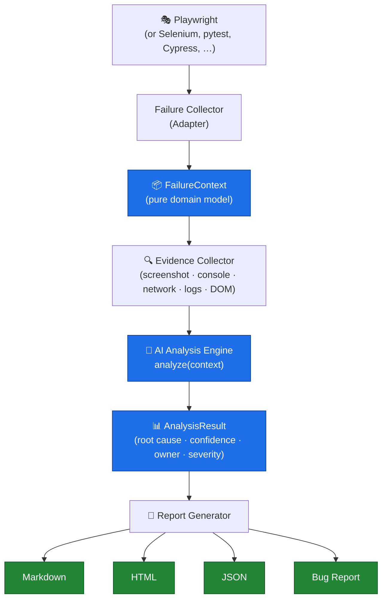
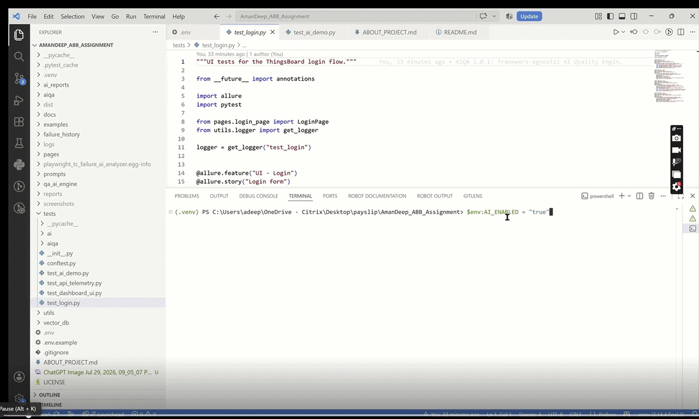

<div align="center">

# AIQA — AI-powered Quality Engineering SDK

**AI-powered Quality Engineering SDK for intelligent failure analysis, root cause detection, automated bug reporting, and developer-friendly quality insights.**

<br />

<!-- Group 1 — Project -->
[](https://pypi.org/project/multi-framework-tc-failure-ai-analyzer/)
[](https://pypi.org/project/multi-framework-tc-failure-ai-analyzer/)
[](LICENSE)
[](#)
[](#)

<!-- Group 2 — Quality -->
[](https://github.com/amandeepsdet/multi-framework-tc-failure-ai-analyzer/actions/workflows/ci.yml)
[](https://github.com/amandeepsdet/multi-framework-tc-failure-ai-analyzer/actions/workflows/ci.yml)
<!-- TODO(coverage): enable once coverage reporting (e.g. Codecov) is wired —
[](https://codecov.io/gh/amandeepsdet/multi-framework-tc-failure-ai-analyzer) -->
[](https://github.com/astral-sh/ruff)
[](https://github.com/psf/black)
[](#)

<!-- Group 3 — Community -->
[](https://github.com/amandeepsdet/multi-framework-tc-failure-ai-analyzer/stargazers)
[](https://github.com/amandeepsdet/multi-framework-tc-failure-ai-analyzer/network/members)
[](https://github.com/amandeepsdet/multi-framework-tc-failure-ai-analyzer/issues)
[](https://github.com/amandeepsdet/multi-framework-tc-failure-ai-analyzer/pulls)
[](https://pypi.org/project/multi-framework-tc-failure-ai-analyzer/)
[](https://github.com/amandeepsdet/multi-framework-tc-failure-ai-analyzer/releases)

<!-- Group 4 — Documentation -->
[](PACKAGE_README.md)
[](examples/)
[](PACKAGE_README.md#core-domain)
[](docs/MIGRATION.md)
[](CONTRIBUTING.md)
[](#roadmap)
[](#12-security)

<br />

**[Architecture](#architecture)** ·
**[Installation](#quick-install)** ·
**[Quick Start](#quick-start)** ·
**[Examples](#examples)** ·
**[API](PACKAGE_README.md#core-domain)** ·
**[Reports](PACKAGE_README.md#reports)** ·
**[Roadmap](#roadmap)** ·
**[Contributing](#contributing)** ·
**[License](LICENSE)** ·
**[FAQ](#faq)**

</div>

---

`aiqa` is a **framework-agnostic** SDK that turns a failing test from _any_
automation stack into an evidence-grounded **root cause**, **confidence score**,
**owning team**, and **tracker-ready bug report** — fully offline, with an
optional LLM upgrade.

The project **originally started as a Playwright-specific AI failure analyzer**.
It has since evolved into a **framework-agnostic SDK** that supports
**Playwright**, **Selenium**, **Robot Framework**, and **pytest** (plus Cypress,
Appium, Requests, REST Assured, JUnit, NUnit, TestNG, or anything that can emit
JSON) through an **adapter-based architecture** — while the core stays free of
any framework or application knowledge.

> [!IMPORTANT]
> **This package has been renamed.**
> Please install **`multi-framework-tc-failure-ai-analyzer`**. Future releases
> will only be published under the new package. See the
> **[Migration Guide](docs/MIGRATION.md)** for details.

> **→ Full SDK docs & architecture: [PACKAGE_README.md](PACKAGE_README.md)** ·
> runnable [`examples/`](examples/). The ThingsBoard suite further below is the
> **demo project** that exercises the SDK.

## Quick Install

```bash
pip install multi-framework-tc-failure-ai-analyzer            # core SDK (offline)
pip install "multi-framework-tc-failure-ai-analyzer[openai]"  # + optional LLM analysis
```

## Quick Start

Understand the SDK in under a minute:

```python
from aiqa import FailureAnalyzer, FailureContext

# Build a FailureContext (directly, or via an adapter — see Examples)
context = FailureContext.from_dict({
    "metadata": {"test_name": "checkout::test_pay", "framework": "cypress"},
    "exception": {"type": "AssertionError", "message": "server returned HTTP 500"},
    "evidence": {"network": [{"method": "POST", "url": "/api/pay", "status": 500}]},
})

result = FailureAnalyzer().analyze(context)   # analyze(context) -> AnalysisResult

print(result.root_cause.summary)   # e.g. "Backend returned HTTP 500 on POST /api/pay"
print(result.confidence.value)     # e.g. 92
print(result.owner)                # e.g. "Backend / Platform team"
```

Render it as Markdown, JSON, HTML, or a console summary:

```python
from aiqa import render
print(render(result, "markdown", context))   # or "json" | "html" | "console"
```

Aggregate many runs into a historical **Quality Intelligence dashboard**
(quality score, release readiness, trends, flaky detection, run comparison — no
extra dependencies):

```python
from aiqa import QualityPortal

portal = QualityPortal("reports")
portal.begin_run(framework="playwright", environment="staging")
portal.add_failure(result, context)
portal.finish_run()   # -> reports/index.html (dashboard) + reports/run_*/ (per-run report)
```

## Visual Overview

<table>
  <tr>
    <td width="50%"><br /><sub><b>Repository Home</b></sub></td>
    <td width="50%"><br /><sub><b>Architecture Diagram</b></sub></td>
  </tr>
  <tr>
    <td><br /><sub><b>Playwright Test Execution</b></sub></td>
    <td><br /><sub><b>AI Root Cause Analysis Report</b></sub></td>
  </tr>
  <tr>
    <td><br /><sub><b>Generated Bug Report</b></sub></td>
    <td><br /><sub><b>HTML Report</b></sub></td>
  </tr>
  <tr>
    <td><br /><sub><b>CLI Assistant</b></sub></td>
    <td><br /><sub><b>PyPI Package</b></sub></td>
  </tr>
  <tr>
    <td colspan="2" align="center"><br /><sub><b>Project Folder Structure</b></sub></td>
  </tr>
</table>

> Screenshots live in [`docs/images/`](docs/images/) — see that folder's README
> for the expected files. Placeholders render as broken links until captured.

## Architecture

The core domain depends on nothing; framework knowledge lives only in adapters.
Dependencies point in a single direction.



## Demo

<p align="center">
  
</p>

The animated walkthrough runs a failing test, collects evidence, produces an AI
root-cause analysis with a confidence score, generates a bug report and HTML
report, then answers a question via the CLI assistant.

> The GIF is expected at [`docs/demo.gif`](docs/demo.gif). See
> **[docs/DEMO.md](docs/DEMO.md)** for the full storyboard and step-by-step
> instructions to record and optimize it (ScreenToGif · Peek · OBS Studio ·
> asciinema). Keep it **under 30 seconds** and **under 15 MB**.

## Examples

Minimal, runnable examples live in [`examples/`](examples/):

| Framework | Path | Shows |
|-----------|------|-------|
| Generic (any) | [`examples/generic/`](examples/generic/) | `FailureContext` from a dict → analysis → report |
| pytest | [`examples/pytest/`](examples/pytest/) | Adapter wiring in a pytest hook → analysis → console report |
| Playwright | [`examples/playwright/`](examples/playwright/) | Adapter + event recorder → analysis → Markdown report |

```bash
python examples/generic/main.py
python examples/pytest/main.py
python examples/playwright/main.py
```

Full-featured scripts (Selenium, JSON, live page/driver) are also in the
[`examples/`](examples/) root.

## Roadmap

**Completed**

- ✅ AI Failure Analysis
- ✅ Bug Generator
- ✅ HTML Report
- ✅ CLI

**Planned**

- ⬜ Pytest Plugin (first-class `aiqa` plugin)
- ⬜ RAG improvements
- ⬜ Ollama / local-model presets
- ⬜ VS Code Extension
- ⬜ MCP Server
- ⬜ Jira Integration
- ⬜ GitHub Issue Generator
- ⬜ Slack/Teams Notification

## Contributing

Contributions are welcome! To get started:

1. Fork the repo and create a feature branch.
2. Set up the environment: `python -m venv .venv` then `pip install -r requirements.txt`.
3. Run the offline SDK tests: `pytest tests/aiqa -m sdk -o addopts=""`.
4. Keep the core framework-agnostic (no framework imports in `aiqa/core`,
   `aiqa/analysis`, or `aiqa/reporting`).
5. Open a pull request describing the change.

Please run `ruff` and `black` before submitting. Bug reports and feature
requests are tracked in
[GitHub Issues](https://github.com/amandeepsdet/multi-framework-tc-failure-ai-analyzer/issues).

## FAQ

**Does it require an API key?** No. The SDK runs fully offline with a
deterministic heuristic engine and pure-Python similarity search. An LLM is
strictly opt-in.

**Which frameworks are supported?** Any — Playwright, Selenium, Cypress, Robot
Framework, Appium, Requests, REST Assured, JUnit, NUnit, TestNG, pytest, or
anything that can emit JSON, via the adapter layer.

**Will it slow down my test run?** No. Analysis runs only on failure, and the
default offline path adds negligible overhead.

**What's the import name vs the install name?** Install
`multi-framework-tc-failure-ai-analyzer`; import `aiqa`.

**Is the original pytest + Playwright plugin still available?** Yes — the
`qa_ai_engine` pytest plugin ships in the same distribution for backward
compatibility. New projects should prefer the framework-agnostic `aiqa` SDK.

---

# ThingsBoard IoT Dashboard — Automation Framework (SDK demo)

A production-grade test automation framework for the ThingsBoard **Fuel Level
Monitoring** dashboard, built with Python, Pytest, and Playwright. It delivers
end-to-end UI automation, REST API automation, live telemetry validation,
structured logging, screenshots, and rich reporting — engineered as a reusable,
CI/CD-ready framework rather than a one-off script, and used here as the
reference integration for the `aiqa` SDK.

---

## 1. Key Features

- **Dual-layer coverage** — UI (Playwright) and REST API (`requests`) in one suite.
- **Page Object Model** — locators and page actions isolated from tests.
- **Reusable API client** — centralised JWT auth, retries, and error handling.
- **Real-time telemetry validation** — polling-based refresh checks, no hard-fail on first read.
- **Negative & security coverage** — invalid login, empty credentials, wrong password, expired/tampered JWT, unauthorized access, missing device.
- **Config-driven** — every URL, credential, timeout, and range is centralised and env-overridable.
- **Secrets management** — `.env` + environment variables; nothing hardcoded.
- **Rich reporting** — Allure (primary) and self-contained pytest-html (fallback).
- **Automatic diagnostics** — screenshot-on-failure, video retention, timestamped logs.
- **Cross-browser** — Chromium, Firefox, WebKit via a single flag.
- **Fresh-run hygiene** — screenshots/reports auto-cleaned at the start of each run.
- **AI-extensible** — a companion `skill.md` lets coding agents extend the suite safely.

---

## 2. Framework Design Goals

| Goal | How it is achieved |
|------|--------------------|
| **Maintainability** | POM, single-responsibility modules, no duplicated retry/logging logic. |
| **Scalability** | Add tests/pages/endpoints without touching unrelated layers. |
| **Reusability** | Shared `config`, `api_client`, `helpers`, and fixtures across all suites. |
| **Configurability** | Central `Config` dataclass, fully overridable via environment variables. |
| **CI/CD readiness** | Headless mode, env-based secrets, machine-readable reports, artifact output. |
| **Cloud readiness** | Targets ThingsBoard Cloud; endpoints and host are config-driven. |
| **AI extensibility** | `skill.md` documents conventions/recipes so agents generate conformant code. |

---

## 3. Project Overview

The framework validates a ThingsBoard IoT dashboard across two layers:

- **UI layer** — login, dashboard rendering, telemetry columns, value ranges, and
  live (real-time) telemetry refresh, driven through Playwright.
- **API layer** — JWT authentication, device discovery, and telemetry retrieval
  against the ThingsBoard REST API, driven through `requests`.

Telemetry is surfaced by a **"Tanks" table** widget whose columns expose each
tank's Remaining (fuel), Temperature, Battery, and Connection status.

---

## 4. Architecture

```
Tests (pytest)
   │  use fixtures (conftest.py)
   ▼
Page Objects (pages/)          API Client (utils/api_client.py)
   │  drive Playwright             │  drive requests
   ▼                               ▼
Utilities (utils/): config · logger · helpers (polling, ranges, screenshots)
```

### Architecture Principles

- **Page Object Model (POM)** — every UI locator/action lives in a page class; tests never touch raw selectors.
- **Separation of concerns** — UI, API, configuration, logging, and helpers are independent layers.
- **Centralized configuration** — a single immutable `Config` singleton is the only source of URLs, credentials, timeouts, and ranges.
- **Reusable API client** — all HTTP concerns (JWT, headers, retries, error mapping) are encapsulated in `ThingsBoardAPIClient`.
- **Dependency injection via fixtures** — `conftest.py` builds authenticated pages/clients and injects them into tests.
- **Centralized logging** — one `get_logger()` factory; every layer logs consistently to console and file.
- **Explicit synchronization** — Playwright `wait_for`/`expect` waits; the only fixed waits are deliberate polling intervals.
- **Retry mechanisms** — a single `poll_until` primitive serves both UI real-time checks and API eventual-consistency reads.
- **Secure configuration management** — secrets are read from `.env`/environment and never committed.

---

## 5. Folder Structure

```
ABB_Assignment/
├── pages/
│   ├── base_page.py          # Shared page behaviour
│   ├── login_page.py         # Login POM
│   └── dashboard_page.py     # Dashboard POM (Tanks table)
├── tests/
│   ├── conftest.py           # Fixtures + failure screenshot hook + fresh-run cleanup
│   └── test_login.py         # Login UI tests (incl. negative)
├── utils/
│   ├── config.py             # Central config (env-overridable)
│   ├── logger.py             # Console + file logging
│   ├── helpers.py            # Parsing, ranges, polling, screenshots
│   └── api_client.py         # ThingsBoard REST API client
├── docs/
│   ├── test_cases.md         # 16 documented test cases (+ .xlsx export)
│   └── bug_report.md         # Usability observations (+ .xlsx export)
├── tools/
│   └── export_test_cases_xlsx.py  # Regenerates the Excel docs
├── screenshots/              # Captured screenshots (runtime)
├── reports/                  # Allure results + pytest-html (runtime)
├── logs/                     # Timestamped log files (runtime)
├── .env / .env.example       # Secrets (gitignored) + template
├── requirements.txt
├── pytest.ini
├── skill.md                  # AI-agent onboarding skill
└── README.md
```

---

## 6. Technology Stack

Chosen deliberately, not just listed:

| Tool | Why it was chosen |
|------|-------------------|
| **Playwright** | Fast, reliable auto-waiting engine with first-class cross-browser (Chromium/Firefox/WebKit) support and built-in tracing/video/screenshots — far less flaky than Selenium and no separate driver management. |
| **Pytest** | Powerful fixtures, markers, parametrization, and a huge plugin ecosystem — enables clean dependency injection and layered test organization. |
| **Requests** | Simple, battle-tested HTTP client ideal for a thin, readable REST API wrapper with full control over headers/JWT. |
| **Allure** | Rich, structured reporting grouped by feature/story/severity that clearly highlights negative/security scenarios — interview- and stakeholder-friendly. |
| **pytest-html** | Zero-dependency, self-contained HTML report that works anywhere without Java/CLI — a reliable fallback for quick sharing and CI artifacts. |

Supporting: `pytest-playwright` (Playwright↔pytest integration), `python-dotenv`
(secrets), `openpyxl` (docs → Excel export).

---

## 7. Framework Metrics

| Metric | Value |
|--------|-------|
| Test suites | 1 (`test_login`) |
| Automated test cases | login UI (incl. negative) |
| Page objects | 3 (`BasePage`, `LoginPage`, `DashboardPage`) |
| Utility modules | 4 (`config`, `api_client`, `helpers`, `logger`) |
| Supported browsers | 3 (Chromium, Firefox, WebKit) |
| Reporting formats | 2 (Allure + pytest-html) |
| Retry mechanisms | 1 shared primitive (`poll_until`) for UI + API |
| Logging | Console + timestamped file logs |
| Screenshots | On-demand `capture()` + automatic on-failure |
| Configuration sources | Defaults → `.env` → environment variables |

---

## 8. Requirements

- Python 3.11+
- No Node required (Playwright Python installs its own browsers)
- Packages in `requirements.txt`: Playwright, Pytest, pytest-playwright,
  requests, allure-pytest, pytest-html, python-dotenv

---

## 9. Installation

> The automation account lives on **ThingsBoard Cloud** (`https://thingsboard.cloud`),
> confirmed via the JWT issuer. The device list endpoint is `/api/tenant/devices`.

```powershell
# 1. Create and activate a virtual environment
py -m venv .venv
.\.venv\Scripts\Activate.ps1

# 2. Install dependencies
pip install -r requirements.txt

# 3. Install Playwright browsers
python -m playwright install
```

### Configuration

All settings live in `utils/config.py` and can be overridden with environment
variables (recommended for credentials in CI):

| Variable            | Purpose                    | Default                     |
|---------------------|----------------------------|-----------------------------|
| `TB_BASE_URL`       | Application URL            | `https://thingsboard.cloud` |
| `TB_USERNAME`       | Login username            | assignment account          |
| `TB_PASSWORD`       | Login password            | assignment account          |
| `TB_DASHBOARD_NAME` | Dashboard to open         | `Fuel Level Monitoring`     |
| `TB_TIMEOUT_MS`     | Default wait timeout       | `30000`                     |
| `TB_POLL_RETRIES`   | Real-time poll retries     | `3`                         |
| `TB_POLL_INTERVAL`  | Poll interval (seconds)    | `5`                         |
| `TB_API_RETRIES`    | Telemetry API retries      | `3`                         |

Example:

```powershell
$env:TB_PASSWORD = "your-password"
pytest
```

---

## 10. How to Execute

```powershell
# Run the entire suite (headed browser + reports)
pytest

# Run headless
pytest --headed=false

# Run a single layer using markers
pytest -m api
pytest -m ui
pytest -m realtime
pytest -m negative

# Run a single file or test
pytest tests/test_login.py

# Cross-browser
pytest --browser firefox
pytest --browser webkit
```

### Generate the report

**Allure (primary report).** Results are written to `reports/allure-results`
automatically on every run. Rendering requires the Allure CLI (needs Java):

```powershell
# One-time: install Java (JRE 8+) and the Allure CLI
#   - Java:   https://adoptium.net  (or: winget install EclipseAdoptium.Temurin.21.JRE)
#   - Allure: npm install -g allure-commandline   (or: scoop install allure)

allure serve reports/allure-results
allure generate reports/allure-results -o reports/allure-report --clean
```

**pytest-html (fallback report).** A self-contained report is produced at
`reports/report.html` — open it directly, no extra tooling required.

Logs go to `logs/automation_<timestamp>.log` and screenshots to `screenshots/`.

---

## 11. CI/CD Readiness

The framework can run unattended in any CI system — **Jenkins, GitHub Actions,Azure DevOps, or GitLab CI** — with little/no code changes:

- **Environment-based secrets** — credentials/JWT come from environment variables,
  so pipelines inject them from their secret stores (never committed).
- **Headless execution** — run with `pytest --headed=false` for agents/containers.
- **Report publishing** — Allure results (`reports/allure-results`) and the
  self-contained `reports/report.html` are ready to publish as build artifacts or
  via the CI's Allure/HTML report plugins.
- **Artifact collection** — screenshots, videos (`retain-on-failure`), and logs
  are written to predictable folders for archiving.
- **Deterministic runs** — fresh-run cleanup + `--clean-alluredir` guarantee each
  build starts from a clean state.
- **Selective execution** — markers (`ui`, `api`, `realtime`, `negative`) enable
  fast smoke stages and full regression stages.

Example (GitHub Actions step):

```yaml
- run: pip install -r requirements.txt && python -m playwright install --with-deps
- env:
    TB_PASSWORD: ${{ secrets.TB_PASSWORD }}
  run: pytest --headed=false
- uses: actions/upload-artifact@v4
  with: { name: reports, path: reports/ }
```

---

## 12. Security

Secrets (`TB_PASSWORD`, `TB_JWT_TOKEN`, and any AI provider keys) are read from
`.env` / environment variables and never committed. The AI engine additionally
**masks secrets** (passwords, JWTs, bearer tokens, API keys, cookies) out of any
evidence *before* it is serialised to disk or sent to an LLM (`AI_MASK_SECRETS`,
on by default; optional URL masking via `AI_MASK_URLS`).

---

## 13. AI Failure Analysis Engine

An optional, enterprise-grade layer that turns raw `PASS`/`FAIL` results into
**AI-assisted root-cause analysis**. When a test fails it answers: *why did it
fail, what component, UI or backend, how confident, on what evidence, who owns
it, what to investigate first, and the probable fix* — then generates a
tracker-ready bug report.

> **Zero-config & backward compatible.** The engine defaults to **OFF**
> (`AI_ENABLED=false`) and, when on, runs fully **offline** with a deterministic
> heuristic analyzer, a pure-Python hash-embedding vector store, and local JSON
> history — **no API keys and no extra dependencies required**. Cloud LLMs and
> ChromaDB are strictly opt-in.

### 13.1 What it does on failure

Automatically collects evidence (screenshot, stacktrace, exception, assertion,
URL, page title, DOM, browser console logs, network requests, API responses,
and rich test metadata), stores it as structured JSON under `failure_history/`,
then produces:

- **Root-cause analysis** — category (UI, Backend, API, Authentication,
  Authorization, Locator, Network, Performance, Infrastructure, Browser,
  Environment, Data, Configuration, Flaky Test, Unknown), an **explained
  confidence score**, severity, likely owner, evidence bullets, and a
  recommended fix.
- **RAG** — retrieves the top-K most similar past failures from a vector store
  and feeds them into the prompt ("this failure resembles…").
- **Bug report** — Markdown / JSON / HTML under `ai_reports/`.
- **Report integration** — an *AI Analysis* section embedded in the pytest-html
  report and attached to Allure (summary, bug report, evidence + analysis JSON).

### 13.2 Architecture

```
tests (pytest) ──fail──► conftest hook
                             │  collect evidence (+ live console/network recorder)
                             ▼
                        ai.AIEngine (façade, dependency-injected)
        ┌───────────────┬───────────────┬────────────────┬───────────────┐
   FailureAnalyzer   HistoryStore    VectorStore     Report/Bug gens
   (heuristic|LLM)   (JSON files)   (JSON|Chroma)    (md/json/html)
        │                                  ▲
   LLMClient (Base→OpenAI/Azure/Claude/Gemini/Ollama)   Embeddings (hash|openai)
```

Every component is behind an interface and injected, so providers/back-ends swap
via configuration only. Prompts are **external** templates in `prompts/`
(`root_cause.txt`, `bug_report.txt`, `release_summary.txt`, `flaky_analysis.txt`,
`locator_analysis.txt`, `visual_analysis.txt`).

### 13.3 Enabling it

```powershell
# Offline heuristic mode (no keys, no extra installs):
$env:AI_ENABLED = "true"
pytest

# Upgrade to a real LLM (example: OpenAI):
$env:AI_PROVIDER = "openai"      # or azure | claude | gemini | ollama
$env:OPENAI_API_KEY = "sk-..."
pip install openai               # only the provider you choose
pytest
```

All switches live in `.env` / environment (see `.env.example`): `AI_PROVIDER`,
`AI_MODEL`, `AI_TEMPERATURE`, `AI_MAX_TOKENS`, `AI_VISION_ENABLED`,
`AI_EMBEDDING_PROVIDER`, `AI_VECTOR_BACKEND`, `AI_RAG_TOP_K`, `AI_MASK_SECRETS`.

**Local models (bonus):** set `AI_PROVIDER=ollama` and run Ollama with
`llama3` / `mistral` / `deepseek` — no cloud, no key.

### 13.4 Trend analysis & release readiness

Aggregates the failure history into most-common failures, category distribution,
flaky tests, most-failing APIs/widgets, average runtime, and a day-by-day trend;
then scores **release readiness** (0–100), a risk band, and a
Release / Investigate / Block verdict.

---

## 14. QA AI Assistant (CLI + Chat)

An interactive, RAG-grounded assistant exposing the framework through a CLI and
a conversational REPL. Business logic lives in the reusable `assistant` package
(front-end-agnostic and **MCP-ready**).

```powershell
python qa_ai.py analyze-last-failure
python qa_ai.py explain tests/test_ai_demo.py::test_demo_wrong_locator
python qa_ai.py summarize-run
python qa_ai.py generate-bug
python qa_ai.py search "temperature widget failures"
python qa_ai.py find-flaky-tests
python qa_ai.py release-readiness
python qa_ai.py explain-widget FuelLevel
python qa_ai.py explain-api telemetry
python qa_ai.py suggest-locator "Fuel Level"
python qa_ai.py generate-test "Battery widget"
python qa_ai.py dashboard-summary
python qa_ai.py analyze-report reports/report.html
python qa_ai.py ask "Why did TC-07 fail?"
python qa_ai.py                 # interactive chat mode
```

The assistant understands natural language ("Which tests are flaky?", "Generate
a Jira bug", "Are we ready to release?", "Suggest a Playwright locator") and
routes each request to a modular tool (`AnalyzeFailureTool`, `SearchHistoryTool`,
`GenerateBugTool`, `ReleaseReadinessTool`, `TrendAnalysisTool`, …) that exposes
`execute()`, `description()`, and `examples()`.

### AI folder additions

```
ai/                       # AI Failure Analysis Engine (see §13.2)
assistant/                # QA AI Assistant (CLI + chat + tools, MCP-ready)
prompts/                  # external prompt templates (not hardcoded)
failure_history/          # structured failure JSON (runtime)
ai_reports/               # analysis + bug reports md/json/html (runtime)
vector_db/                # RAG vector index (runtime)
qa_ai.py                  # assistant CLI entry point
tests/ai/                 # offline unit tests for the AI engine
```


- **Secrets in `.env`** — password and optional pre-issued JWT are loaded from a
  gitignored `.env` (via `python-dotenv`); `.env.example` documents the keys.
- **Environment overrides** — real environment variables always take precedence,
  which is the recommended path for CI secret stores.
- **JWT handling** — tokens are acquired at runtime, stored only in memory on the
  session, and sent as `X-Authorization: Bearer <jwt>`; tampered/expired tokens
  are explicitly tested to be rejected.
- **No credentials in source control** — nothing is hardcoded; `.env` is listed in
  `.gitignore`, and only non-secret defaults live in `config.py`.

```powershell
Copy-Item .env.example .env   # then edit .env with your real values
```

`.env` keys: `TB_PASSWORD` (required), `TB_JWT_TOKEN` (optional).

---

## 13. Framework Design Notes

- **Single retry primitive** (`utils/helpers.poll_until`) reused for UI real-time
  refresh and API eventual-consistency reads — no duplicated retry loops.
- **Explicit waits** everywhere; the only fixed waits are polling intervals.
- **Config-driven ranges** for fuel (0–100), temperature (−40–100), battery
  (0–100), and connection-state validation.
- **Negative & security coverage** across both UI and API layers.
- **Screenshot-on-failure** is automatic via a pytest hook.

---

## 14. Assignment Notes

The original assignment supplied ThingsBoard **demo credentials that were
inactive**. To preserve every assignment objective, the framework was completed
against a **personal ThingsBoard Cloud tenant** (`https://thingsboard.cloud`) with
the official **Fuel Level Monitoring** solution template installed. This provides
equivalent live telemetry (fuel, temperature, battery, connection) and dashboard
widgets, so all UI, API, real-time, negative, and boundary scenarios remain fully
valid — only the environment host changed.

---

## 15. Assumptions

- The account has the official **Fuel Level Monitoring** dashboard installed.
- At least one device with telemetry exists for the tenant.
- Telemetry frequency depends on the simulator, so real-time tests **report**
  rather than hard-fail when values do not change within the polling window.
- ThingsBoard DOM/class names are relatively stable; locators favour roles and
  visible text to reduce brittleness.

---

## 16. Known Limitations

- Widget value extraction relies on visible text and may need locator tuning if
  the dashboard layout changes significantly.
- Logout is performed implicitly by closing the browser context; an explicit
  logout locator can be added if a stable selector is required.
- Connection-status validation is best-effort because the device may not always
  expose that key.

---

## 17. Future Enhancements

- **Docker support** — containerized runs for reproducible CI execution.
- **Parallel execution** — `pytest-xdist` for faster suites.
- **GitHub Actions** — ready-made workflow for PR gating and nightly regression.
- **Jenkins pipelines** — declarative pipeline with Allure publishing.
- **Browser matrix execution** — Chromium/Firefox/WebKit in a single CI matrix.
- **Performance testing** — API latency/throughput benchmarks.
- **Accessibility testing** — automated a11y checks (e.g. axe-core).
- **Visual regression testing** — screenshot diffing for UI drift.
- **Slack/Teams notifications** — real-time pass/fail alerts to channels.
- **Email reporting** — scheduled report delivery to stakeholders.
- **Advanced test data management** — fixtures/factories and externalized datasets.

---

See `docs/test_cases.md` for the full test matrix, `docs/bug_report.md` for
usability observations, and `skill.md` for how AI coding agents can extend the
framework.
